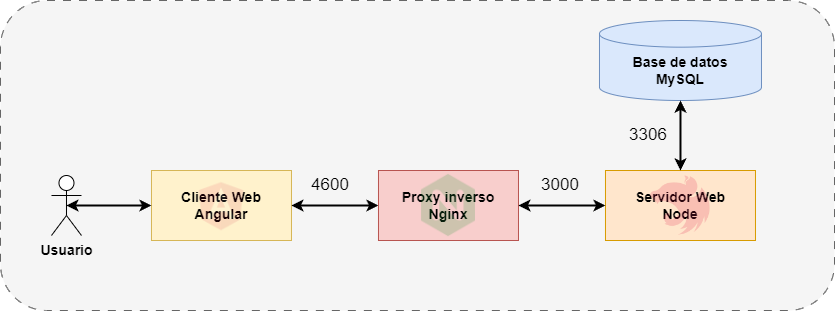
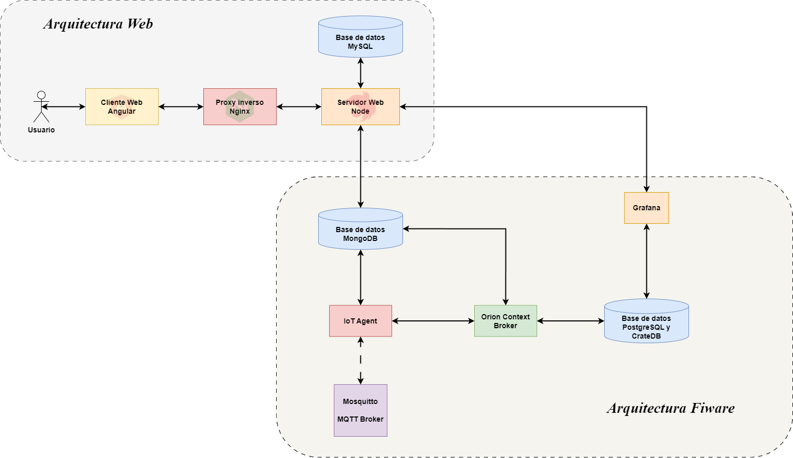
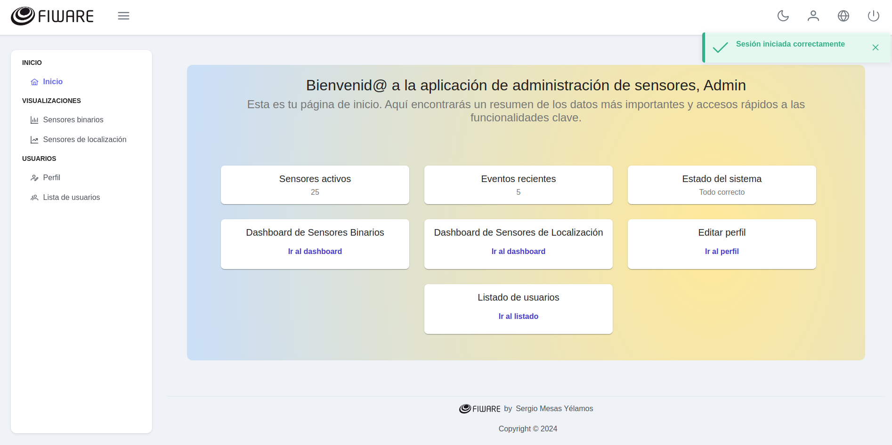

# :hammer_and_wrench: Proyecto Web FIWARE

Este proyecto es un entorno web completo que incluye backend, frontend, base de datos MySQL, y un servidor Nginx para el manejo de solicitudes HTTP/HTTPS. Utiliza Docker para facilitar el despliegue y la gestión de los servicios.


> Angular 15 + NestJS 9 starter project  

<hr />


[]()


# Índice

  - [Demo](#demo)
  - [Arquitectura](#arquitectura)
  - [Frontend App](#frontend-app)
  - [Instalación](#instalación)
  - [Componentes](#componentes)
  - [Requisitos](#requisitos)
  - [Despliegue](#despliegue)
  - [Notas Adicionales](#notas-adicionales)
  - [Despliegue Local](#despliegue-local)
  - [License](#license)

## Demo
- [Servidor UGR](https://amaltea.ugr.es/mifiware-tfm/auth/login)

## Arquitectura

A continuación, se presenta la arquitectura de la plataforma wb así como al conexión con la plataforma de FIWARE.

### Arquitectura Web



### Arquitectura FIWARE



## Frontend App



## Instalación

```bash
npm install
```

## Componentes

- **MySQL Database**: Base de datos relacional para almacenar los datos del proyecto.
- **Adminer**: Herramienta de administración de bases de datos a través de la web.
- **API**: Backend desarrollado en NestJS, que se comunica con la base de datos MySQL.
- **Nginx**: Servidor web utilizado como proxy inverso para dirigir las solicitudes a los servicios correspondientes.
- **Frontend**: Aplicación frontend desarrollada con Angular, construida y servida desde un contenedor Docker.

## Requisitos

- Docker y Docker Compose instalados en el sistema.
- Archivo `.env` en el directorio raíz con las variables de entorno necesarias para los servicios.

## Despliegue

1. **Preparación**: Asegúrate de tener un archivo `.env` en el directorio raíz con todas las variables de entorno necesarias definidas.

2. **Construcción y Despliegue**: Ejecuta el siguiente comando en el directorio raíz del proyecto para construir y desplegar los servicios:

    ```bash
    docker-compose up --build
    ```

    Este comando construirá las imágenes necesarias y desplegará los contenedores definidos en el archivo `docker-compose.yml`.

3. **Acceso a los Servicios**:
    - **Adminer**: Accede a Adminer en `http://localhost:8080` para gestionar la base de datos MySQL.
    - **API**: La API estará disponible en el puerto definido por la variable `NESTJS_APP_LOCAL_PORT` en el archivo `.env`.
    - **Frontend**: El frontend estará accesible en el puerto `4601` y a través de Nginx en los puertos `80` (HTTP) y `443` (HTTPS).

4. **Gestión de Servicios**: Para detener los servicios, puedes usar el comando `docker-compose down`. Esto detendrá y eliminará los contenedores, redes y volúmenes definidos en el archivo `docker-compose.yml`.

## Notas Adicionales

- Asegúrate de tener los certificados SSL necesarios para Nginx si planeas servir el contenido a través de HTTPS.
- Personaliza el archivo `nginx.conf` según tus necesidades para la configuración del servidor web.

Este proyecto proporciona una base sólida para el desarrollo y despliegue de aplicaciones web completas utilizando tecnologías modernas y contenedores Docker.

## Despliegue Local

Para ejecutar el proyecto localmente sin Docker, puedes utilizar los siguientes comandos:

- **Frontend**:
    ```bash
    npm run serve:app
    ```
    Este comando inicia la aplicación frontend en el puerto `4601`.

- **Backend**:
    ```bash
    npm run serve:api
    ```
    Este comando inicia el backend API en el modo de desarrollo.

Asegúrate de tener todas las dependencias necesarias instaladas y configuradas correctamente antes de ejecutar estos comandos.

## License
MIT License

Copyright (c) 2023 Sergio Mesas Yélamos

Permission is hereby granted, free of charge, to any person obtaining a copy
of this software and associated documentation files (the "Software"), to deal
in the Software without restriction, including without limitation the rights
to use, copy, modify, merge, publish, distribute, sublicense, and/or sell
copies of the Software, and to permit persons to whom the Software is
furnished to do so, subject to the following conditions:

The above copyright notice and this permission notice shall be included in all
copies or substantial portions of the Software.

THE SOFTWARE IS PROVIDED "AS IS", WITHOUT WARRANTY OF ANY KIND, EXPRESS OR
IMPLIED, INCLUDING BUT NOT LIMITED TO THE WARRANTIES OF MERCHANTABILITY,
FITNESS FOR A PARTICULAR PURPOSE AND NONINFRINGEMENT. IN NO EVENT SHALL THE
AUTHORS OR COPYRIGHT HOLDERS BE LIABLE FOR ANY CLAIM, DAMAGES OR OTHER
LIABILITY, WHETHER IN AN ACTION OF CONTRACT, TORT OR OTHERWISE, ARISING FROM,
OUT OF OR IN CONNECTION WITH THE SOFTWARE OR THE USE OR OTHER DEALINGS IN THE
SOFTWARE.
